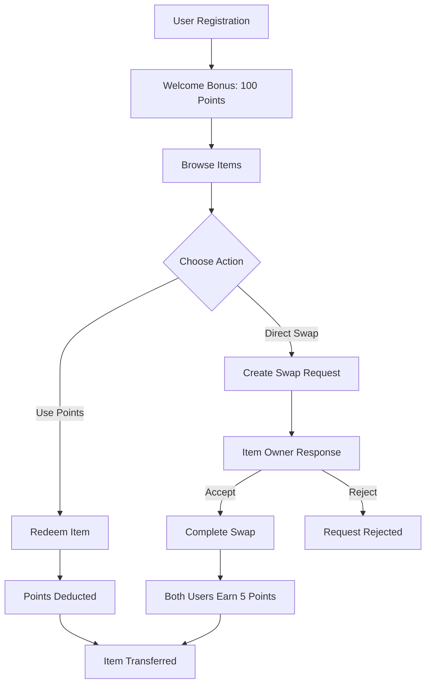
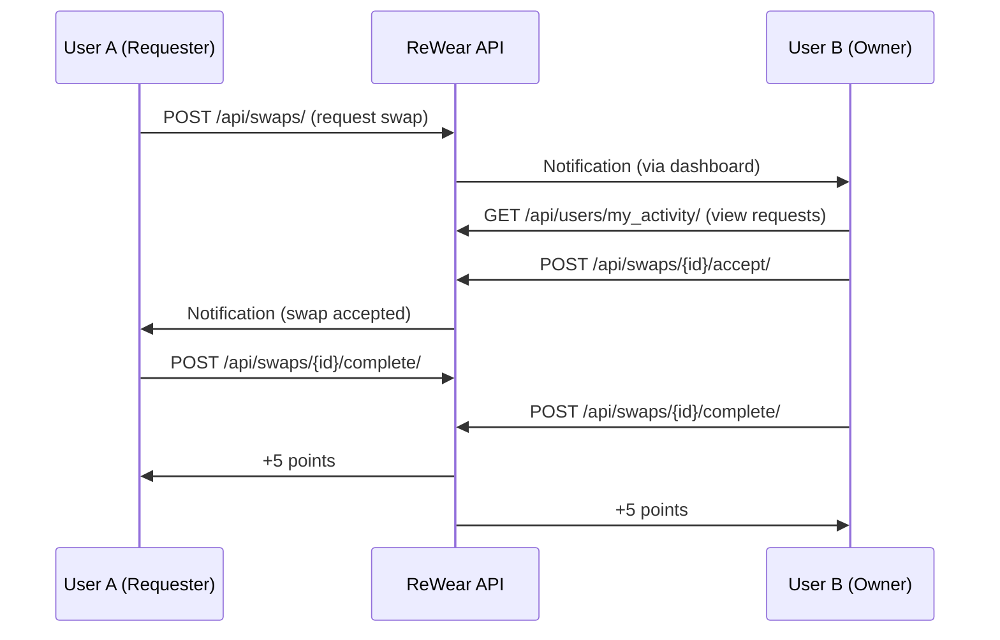

# ReWear API Documentation

<div align="center">


</div>

## Overview

The ReWear API is a RESTful service built with Django REST Framework that powers a sustainable fashion platform for clothing exchanges. Users can swap items directly or redeem them using points earned through platform activities.

### Base URL
```
http://localhost:8000/api
```

### Authentication
The API uses JWT (JSON Web Tokens) for authentication. Include the token in the Authorization header:
```
Authorization: Bearer <your_jwt_token>
```

---

## API Flow Diagram



---

## Authentication Endpoints

### Register User
```http
POST /api/users/register/
```

**Request Body:**
```json
{
  "username": "fashionlover",
  "email": "user@example.com",
  "password": "securepass123",
  "password_confirm": "securepass123",
  "first_name": "Jane",
  "last_name": "Doe",
  "location": "New York"
}
```

**Response:**
```json
{
  "user": {
    "id": 1,
    "username": "fashionlover",
    "email": "user@example.com",
    "points": 100,
    "location": "New York"
  },
  "access": "eyJ0eXAiOiJKV1QiLCJhbGciOiJIUzI1NiJ9...",
  "refresh": "eyJ0eXAiOiJKV1QiLCJhbGciOiJIUzI1NiJ9...",
  "message": "Welcome to ReWear! You've received 100 welcome points."
}
```

### Login User
```http
POST /api/users/login/
```

**Request Body:**
```json
{
  "username": "fashionlover",
  "password": "securepass123"
}
```

---

## User Management

### Get Current User Profile
```http
GET /api/users/me/
```

**Response:**
```json
{
  "id": 1,
  "username": "fashionlover",
  "email": "user@example.com",
  "first_name": "Jane",
  "last_name": "Doe",
  "points": 95,
  "location": "New York",
  "profile_picture": null,
  "is_private": false,
  "date_joined": "2025-01-01T00:00:00Z"
}
```

### Get Dashboard Data
```http
GET /api/users/dashboard/
```

**Response:**
```json
{
  "profile": {
    "username": "fashionlover",
    "points": 95,
    "total_items": 3,
    "available_items": 2,
    "swapped_items": 1
  },
  "stats": {
    "total_views": 45,
    "total_likes": 12,
    "swap_requests_sent": 5,
    "swap_requests_received": 3,
    "successful_swaps": 2
  },
  "recent_activity": [...]
}
```

### Get User's Liked Items
```http
GET /api/users/liked_items/
```

---

## Item Management

### List Items
```http
GET /api/items/
```

**Query Parameters:**
- `search` - Text search in title, description, tags, brand
- `category` - Filter by category (tops, bottoms, dresses, etc.)
- `condition` - Filter by condition (new, excellent, good, fair)
- `size` - Filter by size
- `color` - Filter by color
- `min_points` - Minimum point value
- `max_points` - Maximum point value
- `ordering` - Sort by (created_at, -created_at, view_count, like_count, point_value)
- `page` - Page number
- `page_size` - Items per page (max: 50)

**Example:**
```http
GET /api/items/?category=tops&ordering=-like_count&page=1&page_size=12
```

### Get Featured Items
```http
GET /api/items/featured/
```

### Get Item Details
```http
GET /api/items/{id}/
```

**Response:**
```json
{
  "id": 1,
  "title": "Vintage Denim Jacket",
  "description": "Beautiful vintage denim jacket from the 90s...",
  "category": "outerwear",
  "size": "M",
  "condition": "excellent",
  "point_value": 15,
  "status": "available",
  "tags": ["vintage", "denim", "casual"],
  "color": "blue",
  "brand": "Levi's",
  "view_count": 23,
  "like_count": 5,
  "owner": {
    "id": 2,
    "username": "vintagelover",
    "profile_picture": null
  },
  "images": [
    {
      "id": 1,
      "image": "/media/items/2025/01/jacket1.jpg",
      "is_primary": true,
      "alt_text": "Front view of vintage denim jacket"
    }
  ],
  "created_at": "2025-01-01T12:00:00Z"
}
```

### Create Item
```http
POST /api/items/
```

**Request Body (multipart/form-data):**
```json
{
  "title": "Vintage Denim Jacket",
  "description": "Beautiful vintage jacket...",
  "category": "outerwear",
  "size": "M",
  "condition": "excellent",
  "point_value": 15,
  "tags": "vintage, denim, casual",
  "color": "blue",
  "brand": "Levi's",
  "images": [file1, file2, ...]
}
```

### Update Item
```http
PUT /api/items/{id}/
```

### Delete Item
```http
DELETE /api/items/{id}/
```

### Like/Unlike Item
```http
POST /api/items/{id}/like/
```

**Response:**
```json
{
  "liked": true,
  "like_count": 6
}
```

### Get Categories and Conditions
```http
GET /api/items/categories/
```

**Response:**
```json
{
  "categories": [
    {"value": "tops", "label": "Tops"},
    {"value": "bottoms", "label": "Bottoms"},
    {"value": "dresses", "label": "Dresses"}
  ],
  "conditions": [
    {"value": "new", "label": "New (with tags)"},
    {"value": "excellent", "label": "Excellent"},
    {"value": "good", "label": "Good"},
    {"value": "fair", "label": "Fair"}
  ]
}
```

---

## Swap System

### Swap Flow Diagram



### Create Swap Request
```http
POST /api/swaps/
```

**Request Body:**
```json
{
  "requested_item": 5,
  "offered_item": 12,
  "message": "I love your vintage jacket! Would you swap for my designer bag?"
}
```

**Response:**
```json
{
  "id": 1,
  "requester": {
    "id": 1,
    "username": "fashionlover"
  },
  "requested_item": {
    "id": 5,
    "title": "Vintage Denim Jacket",
    "images": [...]
  },
  "offered_item": {
    "id": 12,
    "title": "Designer Handbag",
    "images": [...]
  },
  "status": "pending",
  "message": "I love your vintage jacket!...",
  "created_at": "2025-01-01T15:30:00Z"
}
```

### List User's Swaps
```http
GET /api/swaps/
```

**Response:**
```json
{
  "count": 10,
  "next": null,
  "previous": null,
  "results": [
    {
      "id": 1,
      "status": "pending",
      "requested_item": {...},
      "offered_item": {...},
      "message": "Would love to swap!",
      "created_at": "2025-01-01T15:30:00Z"
    }
  ]
}
```

### Accept Swap Request
```http
POST /api/swaps/{id}/accept/
```

### Reject Swap Request
```http
POST /api/swaps/{id}/reject/
```

### Complete Swap
```http
POST /api/swaps/{id}/complete/
```

**Response:**
```json
{
  "message": "Swap completed successfully!",
  "points_earned": 5,
  "new_point_balance": 100
}
```

### Cancel Swap
```http
POST /api/swaps/{id}/cancel/
```

---

## Points Redemption

### Redeem Item with Points
```http
POST /api/swaps/redeem/
```

**Request Body:**
```json
{
  "item_id": 5
}
```

**Response:**
```json
{
  "message": "Item redeemed successfully!",
  "points_deducted": 15,
  "new_point_balance": 80,
  "redeemed_item": {
    "id": 5,
    "title": "Vintage Denim Jacket"
  }
}
```

---

## Reporting System

### Report Item
```http
POST /api/items/items/report/
```

**Request Body:**
```json
{
  "item_id": 5,
  "reason": "Inappropriate content or misleading description"
}
```

### Get Reports Made by User
```http
GET /api/reported-by-me/
```

### Get Reports About User's Items
```http
GET /api/reported-about-me/
```

---

## Platform Statistics

### Get Platform Stats
```http
GET /api/items/stats/
```

**Response:**
```json
{
  "total_items": 1250,
  "total_users": 450,
  "total_swaps": 230,
  "items_by_category": {
    "tops": 350,
    "bottoms": 280,
    "dresses": 220
  },
  "recent_activity": [...]
}
```

---

## Error Responses

### Standard Error Format
```json
{
  "error": "Validation error",
  "details": {
    "email": ["This field is required."],
    "password": ["This field must contain at least 8 characters."]
  }
}
```

### Common HTTP Status Codes
- `200` - Success
- `201` - Created
- `400` - Bad Request (validation errors)
- `401` - Unauthorized (authentication required)
- `403` - Forbidden (insufficient permissions)
- `404` - Not Found
- `500` - Internal Server Error

---

## Interactive Documentation

### Swagger UI
```
http://localhost:8000/swagger/
```

### ReDoc
```
http://localhost:8000/redoc/
```

---

## Rate Limiting & Best Practices

### Recommendations
- Implement pagination for list endpoints
- Use appropriate HTTP methods (GET, POST, PUT, DELETE)
- Handle errors gracefully with proper status codes
- Include authentication tokens in headers
- Validate input data on the frontend before API calls

### Example Frontend Integration

```javascript
// Register new user
const registerUser = async (userData) => {
  const response = await fetch('/api/users/register/', {
    method: 'POST',
    headers: { 'Content-Type': 'application/json' },
    body: JSON.stringify(userData)
  });
  return response.json();
};

// Create swap request
const createSwapRequest = async (swapData, token) => {
  const response = await fetch('/api/swaps/', {
    method: 'POST',
    headers: {
      'Content-Type': 'application/json',
      'Authorization': `Bearer ${token}`
    },
    body: JSON.stringify(swapData)
  });
  return response.json();
};
```

---

*For more detailed examples and testing scripts, check the `test_*.py` files in the backend directory.*
